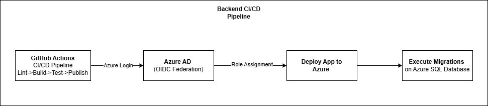

## Github Actions - CI/CD Pipeline

## Deployment Highlights
Triggered on merge to main

4 Stages:
- Lint
- Build
- Test
- Deploy

Uses GitHub OIDC + Azure Federated Identity

Uses Azure Managed Identity for SQL access

Zero secrets in pipeline & uses GitHub Actions' enviroment based secrets

---

